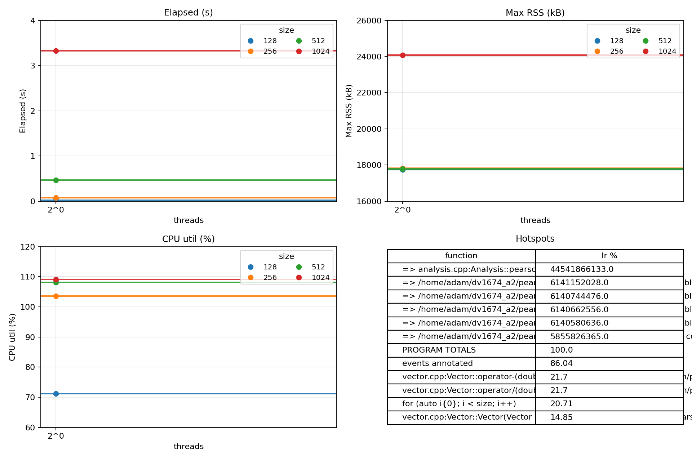
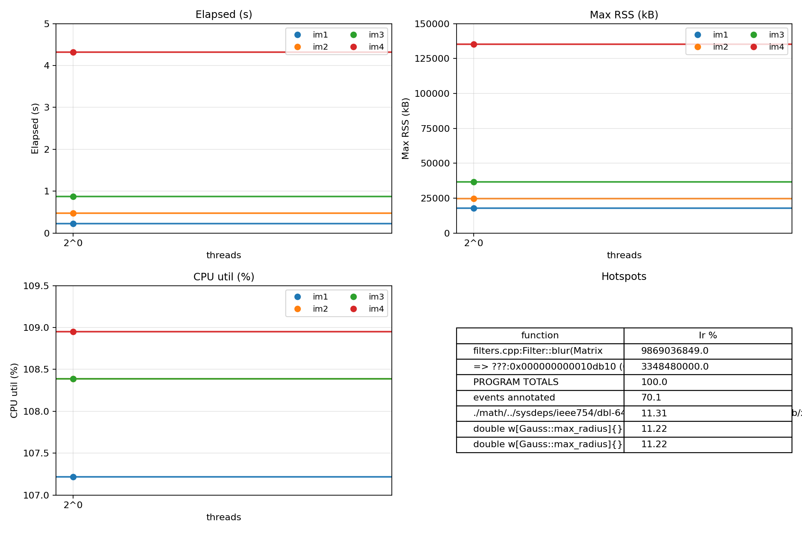
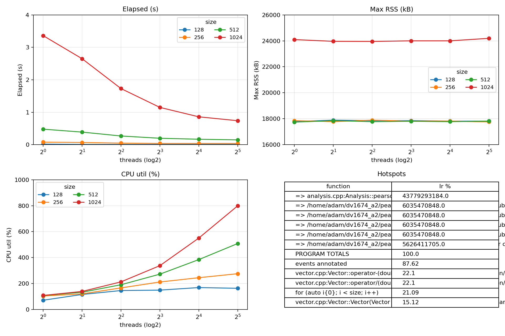
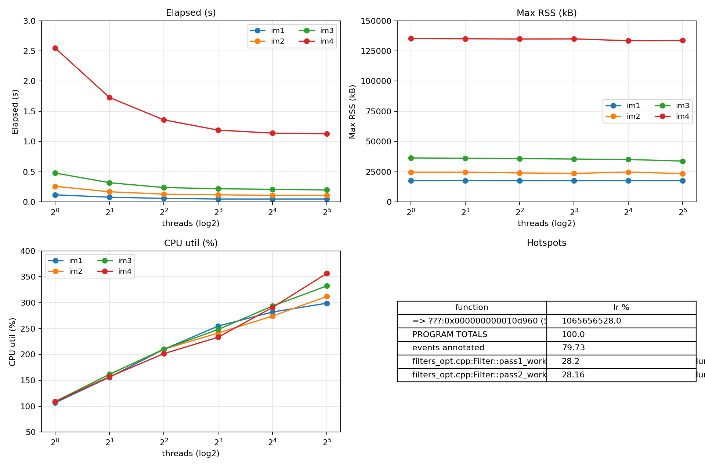
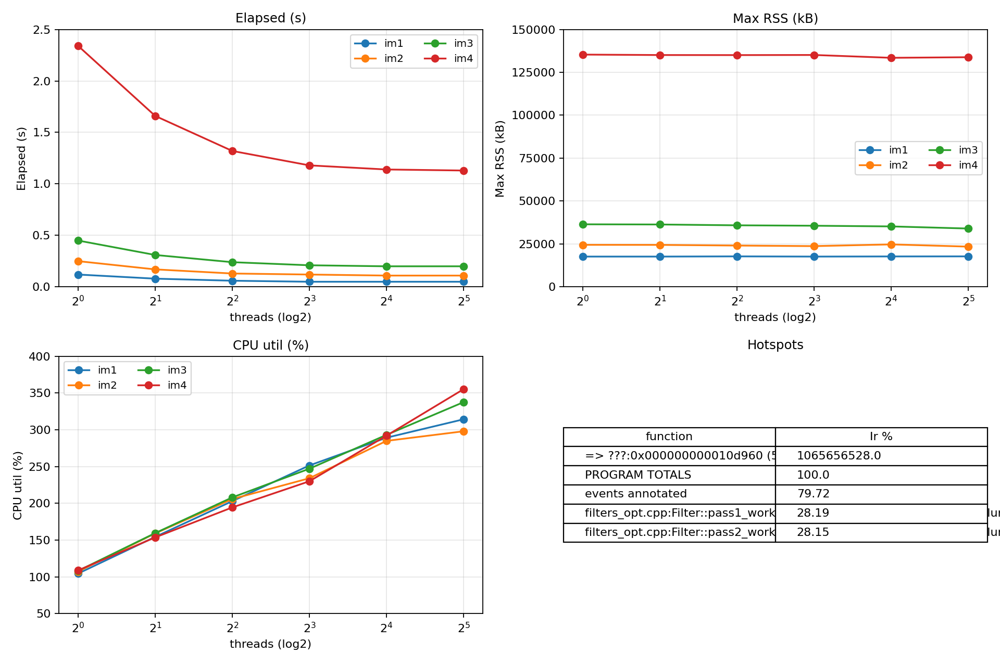

# Title: Optimizing and Parallelizing Pearson & Blur

**Authors:** Adam Abdullah - Daniel Mohagheghifard, Group 1  

## Abstract
_What we optimized and parallelized (Pearson & Blur), the WSL2 environment, headline speedups vs. baseline (see §6), and that outputs were verified for correctness._

---

## 1. Introduction
This report covers baseline measurements for the sequential versions of **Pearson** (pairwise correlation) and **Blur** (two-pass image filter), followed by a pthreads-based parallelization of both applications. We measure execution time, memory (Max RSS), and CPU utilization across dataset/image sizes and thread counts, and we report scalability and speedup relative to the sequential baseline.

---

## 2. Experimental Setup

- **Hardware/OS/Compiler:** 12th Gen Intel® Core™ i9-12900K (12 cores / 24 threads), 31 GiB RAM visible to WSL2, Ubuntu 22.04.5 LTS (kernel 6.6.87.2-microsoft-standard-WSL2), GCC/G++ 11.4.0, glibc 2.35, GNU ld 2.38, Make 4.3, perf 6.6.87, Valgrind 3.18.1. *(Environment: WSL2 on Windows host.)*
- **Build:** C++17, `-O2 -g -pthread`, Makefiles per app.
- **Inputs:**  
  - **Pearson datasets:** `128, 256, 512, 1024` (rows per dataset).  
  - **Blur images:** four `.ppm` files from `data/` (for all measurements, **radius = 15**).
- **Metrics & Tools:** `/usr/bin/time -v` (elapsed, Max RSS), `perf` (task-clock, context-switches, cpu-migrations, page-faults). Callgrind used for hotspot tables.
- **Methodology:** 5 repetitions per point; aggregate with IQR trimming; report `elapsed_mean` and compute **speedup** as `T1 / Tt` (per size).  
- **Correctness:** `verify.sh` (both apps) on representative sizes/images.

---

## 3. Baseline Performance (Sequential, Unoptimized)

### 3.1 Pearson (sequential)
**Algorithm:** mean-center → normalize (L2) → dot product → clamp to `[-1, 1]`.

**Results (aggregated over 5 reps):**

| size | elapsed_mean (s) | Max RSS (kB) | task_clock_ms | CPUs util. (%) |
|-----:|------------------:|--------------:|---------------:|---------------:|
| 128  | 0.0200 | 17,740.8 | 14.2480 | 71.24 |
| 256  | 0.0800 | 17,817.6 | 82.8240 | 103.53 |
| 512  | 0.4700 | 17,779.2 | 508.0380 | 108.10 |
| 1024 | 3.3275 | 24,073.0 | 3,627.5275 | 109.02 |

<!-- Pearson baseline (sequential) -->


**Notes:** Cost grows quadratically with number of datasets (pair count). CPU utilization hovers ~100% on a single thread due to compute-bound inner products and memory locality of contiguous vector storage.

---

### 3.2 Blur (sequential)
**Algorithm:** separable two-pass blur (horizontal into scratch, then vertical into destination) with radius **15**.

**Results (aggregated over 5 reps):**

| image | elapsed_mean (s) | Max RSS (kB) | task_clock_ms | CPUs util. (%) |
| :---: | ---------------: | -----------: | ------------: | -------------: |
|  im1  |           0.2300 |     17,792.0 |      246.5967 |         107.22 |
|  im2  |           0.4800 |     24,804.0 |      520.2400 |         108.39 |
|  im3  |           0.8700 |     36,646.0 |      943.0050 |         108.39 |
|  im4  |           4.3160 |    135,342.4 |    4,702.3820 |         108.95 |

<!-- Blur baseline (sequential) -->


**Notes:** Two-pass structure improves cache locality vs. naïve 2D window; memory bandwidth and image dimensions dominate runtime.

---


## 4. Parallelization with pthreads

### 4.1 Pearson — design & results

**Partitioning:** shard the outer loop over dataset index `i` across threads; pre-size output to `n(n−1)/2`; use deterministic `pair_index(n,i,j)` so each `(i,j)` writes a unique slot. No locks; one join at the end. **Correctness/Order** identical to sequential.

**Scalability & speedup (vs. 1-thread time for same size) _Avg of 5 runs:**

**size = 128** (T₁ = 0.0200 s)

| threads | elapsed_mean (s) | ±95% CI | speedup | efficiency (%) | task_clock_ms | CPUs util. (%) | Max RSS (kB) |
| ------: | ---------------: | ------: | ------: | -------------: | ------------: | -------------: | -----------: |
|       1 |            0.020 |   0.000 |    1.00 |          100.0 |        14.398 |          71.99 |     17,779.2 |
|       2 |            0.014 |   0.004 |    1.43 |           71.4 |        14.630 |         116.49 |     17,894.4 |
|       4 |            0.010 |   0.000 |    2.00 |           50.0 |        14.668 |         146.68 |     17,856.0 |
|       8 |            0.010 |   0.000 |    2.00 |           25.0 |        15.002 |         150.02 |     17,856.0 |
|      16 |            0.010 |   0.000 |    2.00 |           12.5 |        16.954 |         169.54 |     17,817.6 |
|      32 |            0.010 |   0.000 |    2.00 |            6.2 |        16.392 |         163.92 |     17,817.6 |

**size = 256** (T₁ = 0.0800 s)

| threads | elapsed_mean (s) | ±95% CI | speedup | efficiency (%) | task_clock_ms | CPUs util. (%) | Max RSS (kB) |
| ------: | ---------------: | ------: | ------: | -------------: | ------------: | -------------: | -----------: |
|       1 |            0.080 |   0.000 |    1.00 |          100.0 |        83.682 |         104.60 |     17,856.0 |
|       2 |            0.070 |   0.000 |    1.14 |           57.1 |        84.796 |         121.14 |     17,779.2 |
|       4 |            0.050 |   0.000 |    1.60 |           40.0 |        83.514 |         167.03 |     17,894.4 |
|       8 |            0.040 |   0.000 |    2.00 |           25.0 |        85.020 |         212.55 |     17,817.6 |
|      16 |            0.040 |   0.000 |    2.00 |           12.5 |        98.224 |         245.56 |     17,817.6 |
|      32 |            0.040 |   0.000 |    2.00 |            6.2 |       110.580 |         276.45 |     17,760.0 |

**size = 512** (T₁ = 0.4700 s)

| threads | elapsed_mean (s) | ±95% CI | speedup | efficiency (%) | task_clock_ms | CPUs util. (%) | Max RSS (kB) |
| ------: | ---------------: | ------: | ------: | -------------: | ------------: | -------------: | -----------: |
|       1 |            0.484 |   0.004 |    0.97 |           97.1 |       524.110 |         108.29 |     17,740.8 |
|       2 |            0.390 |   0.000 |    1.21 |           60.3 |       521.477 |         133.71 |     17,856.0 |
|       4 |            0.274 |   0.004 |    1.72 |           42.9 |       524.242 |         191.39 |     17,779.2 |
|       8 |            0.200 |   0.000 |    2.35 |           29.4 |       545.752 |         272.88 |     17,808.0 |
|      16 |            0.170 |   0.000 |    2.76 |           17.3 |       654.418 |         384.95 |     17,779.2 |
|      32 |            0.154 |   0.004 |    3.05 |            9.5 |       783.162 |         508.80 |     17,817.6 |

**size = 1024** (T₁ = 3.3275 s)

| threads | elapsed_mean (s) | ±95% CI | speedup | efficiency (%) | task_clock_ms | CPUs util. (%) | Max RSS (kB) |
| ------: | ---------------: | ------: | ------: | -------------: | ------------: | -------------: | -----------: |
|       1 |            3.365 |   0.011 |    0.99 |           98.9 |      3668.517 |         109.02 |     24,096.0 |
|       2 |            2.648 |   0.009 |    1.26 |           62.8 |      3701.418 |         139.78 |     23,961.6 |
|       4 |            1.730 |   0.000 |    1.92 |           48.1 |      3692.432 |         213.44 |     23,952.0 |
|       8 |            1.150 |   0.000 |    2.89 |           36.2 |      3890.397 |         338.29 |     24,000.0 |
|      16 |            0.855 |   0.011 |    3.89 |           24.3 |      4707.970 |         550.75 |     24,000.0 |
|      32 |            0.738 |   0.007 |    4.51 |           14.1 |      5898.746 |         799.21 |     24,192.0 |

<!-- Pearson parallel -->



**Conclusion.** Pearson scales with problem size: at **n=128/256**, speedup saturates near **2×** even as threads rise, and efficiency drops below 25%, indicating overhead dominates short runs. At **n=512/1024**, scaling improves (best **3.05×** and **4.51×** at 32 threads), but efficiency still declines (to **9.5%** and **14.1%**) as synchronization and scheduling overheads grow. **CPU utilization** climbs toward ~800% at 32 threads (≈8 effective cores busy), while **Max RSS** stays essentially flat—parallelism doesn’t increase memory footprint. **task_clock_ms** rises with threads (e.g., +49% at n=512, +61% at n=1024 vs. 1-thread), meaning we “spend” more total CPU time to cut wall-time. For throughput-per-core, the sweet spot is around **8–16 threads** on larger sizes; pushing to 32 threads still reduces latency but with diminishing returns.

---

### 4.2 Blur — design & results

**Partitioning:** split **rows** `[y0, y1)` per thread; join (barrier) between the horizontal and vertical passes; traversal order (x→y) identical to sequential. **Correctness** matches sequential output (verified).

**Scalability & speedup:** (aggregated over 5 reps; `speedup = T1 / Tt`)

***im1** (radius=15)*

| threads | elapsed_mean (s) | ±95% CI | speedup | efficiency (%) | task_clock_ms | CPUs util. (%) | Max RSS (kB) |
| ------: | ---------------: | ------: | ------: | -------------: | ------------: | -------------: | -----------: |
|       1 |           0.2260 |  0.0043 |    1.02 |          101.8 |       242.516 |          107.3 |     17,779.2 |
|       2 |           0.1300 |  0.0000 |    1.77 |           88.5 |       235.056 |          180.8 |     17,740.8 |
|       4 |           0.0840 |  0.0043 |    2.74 |           68.5 |       235.738 |          281.5 |     17,856.0 |
|       8 |           0.0700 |  0.0000 |    3.29 |           41.1 |       259.852 |          371.2 |     17,856.0 |
|      16 |           0.0660 |  0.0043 |    3.48 |           21.8 |       303.170 |          461.8 |     17,817.6 |
|      32 |           0.0600 |  0.0000 |    3.83 |           12.0 |       368.043 |          613.4 |     17,760.0 |

***im2** (radius=15)*

| threads | elapsed_mean (s) | ±95% CI | speedup | efficiency (%) | task_clock_ms | CPUs util. (%) | Max RSS (kB) |
| ------: | ---------------: | ------: | ------: | -------------: | ------------: | -------------: | -----------: |
|       1 |           0.4800 |  0.0000 |    1.00 |          100.0 |       518.907 |          108.1 |     24,614.0 |
|       2 |           0.2800 |  0.0000 |    1.71 |           85.7 |       502.385 |          179.4 |     24,470.0 |
|       4 |           0.1900 |  0.0000 |    2.53 |           63.2 |       514.428 |          270.8 |     24,180.0 |
|       8 |           0.1500 |  0.0000 |    3.20 |           40.0 |       553.757 |          369.2 |     23,958.7 |
|      16 |           0.1425 |  0.0042 |    3.37 |           21.1 |       677.320 |          475.3 |     24,662.0 |
|      32 |           0.1300 |  0.0000 |    3.69 |           11.5 |       775.085 |          596.2 |     23,604.0 |

***im3** (radius=15)*

| threads | elapsed_mean (s) | ±95% CI | speedup | efficiency (%) | task_clock_ms | CPUs util. (%) | Max RSS (kB) |
| ------: | ---------------: | ------: | ------: | -------------: | ------------: | -------------: | -----------: |
|       1 |           0.8700 |  0.0000 |    1.00 |          100.0 |       946.483 |          108.8 |     36,453.0 |
|       2 |           0.5200 |  0.0000 |    1.67 |           83.7 |       939.862 |          180.7 |     36,348.0 |
|       4 |           0.3525 |  0.0081 |    2.47 |           61.7 |       952.418 |          270.2 |     35,924.0 |
|       8 |           0.2900 |  0.0000 |    3.00 |           37.5 |     1,068.957 |          368.6 |     35,605.3 |
|      16 |           0.2600 |  0.0000 |    3.35 |           20.9 |     1,299.428 |          499.8 |     35,156.0 |
|      32 |           0.2460 |  0.0043 |    3.54 |           11.1 |     1,497.474 |          609.0 |     34,004.0 |

***im4** (radius=15)*

| threads | elapsed_mean (s) | ±95% CI | speedup | efficiency (%) | task_clock_ms | CPUs util. (%) | Max RSS (kB) |
| ------: | ---------------: | ------: | ------: | -------------: | ------------: | -------------: | -----------: |
|       1 |           4.2900 |  0.0069 |    1.01 |          100.6 |     4,677.810 |          109.0 |    135,285.0 |
|       2 |           2.6325 |  0.0107 |    1.64 |           82.0 |     4,639.675 |          176.2 |    135,142.0 |
|       4 |           1.8260 |  0.0089 |    2.36 |           59.1 |     4,666.154 |          255.5 |    135,036.0 |
|       8 |           1.4925 |  0.0161 |    2.89 |           36.1 |     5,116.310 |          342.8 |    134,995.0 |
|      16 |           1.3525 |  0.0042 |    3.19 |           19.9 |     6,576.670 |          486.2 |    133,461.0 |
|      32 |           1.3025 |  0.0042 |    3.31 |           10.4 |     7,634.258 |          586.1 |    133,702.0 |

<!-- Blur parallel -->


**Conclusion.** Blur scales nicely up to **8–16 threads**, then flattens as memory bandwidth and the pass-to-pass barrier dominate. Peak speedups at 32 threads are **im1 3.83×**, **im2 3.69×**, **im3 3.54×**, **im4 3.31×**; the gain from 16→32 threads is modest (≈ **im1 +10%**, **im2 +9%**, **im3 +5.7%**, **im4 +3.8%**). CPU utilization reaches ~**613% / 596% / 609% / 586%** (im1–im4) at 32 threads—roughly 6–8 effective cores saturated—while **Max RSS** stays flat. **task_clock_ms** rises versus 1 thread (≈ **+52% / +49% / +58% / +63%** by 32 threads), showing extra total CPU work due to synchronization and memory stalls. On this box, the throughput sweet spot is **8–16 threads**; 32 threads still trims wall-time but with sharply diminishing efficiency.

---
## 5. Optimization and Tuning (Sequential → Parallel → Optimized)
### 5.1 Blur Optimizations:
- **5.1.1 Optimization #1 — Hoist Gaussian weights**

  **Rationale.** We removed redundant `exp()` work by computing Gaussian weights **once per thread** and reusing them in both horizontal and vertical passes.

  **Code touchpoints.** `filters_opt.cpp`: `pass1_worker`, `pass2_worker` (weights array hoisted per thread).

  **Impact (R=15).** Clear single-thread win, and parallel scaling holds. Below compares **baseline T1** (pre-opt, single thread) vs **O1** (post-opt, both passes):

  | image | Before T1 (s) | After O1 (s) |   Δ% | Scaling 1→8 after O1 (×) |
  | ----- | ------------: | -----------: | ---: | -----------------------: |
  | im3   |        0.8440 |        0.480 | 43.1 |                     2.18 |
  | im4   |        4.2675 |        2.546 | 40.3 |                     2.14 |

  

  **Takeaway.** hoisting Gaussian weights trims ~40–43% off the single-thread runtime.

- **5.1.2 Optimization #2 — Row-major traversal (flip loop order in both passes)**

  **Rationale.** Threads own row bands; scanning **rows → cols** (`for (y) for (x)`) matches row-major storage and keeps same-row neighbors hot. Math/borders unchanged.

  **Code touchpoints.** `filters_opt.cpp`: in `pass1_worker` and `pass2_worker`, we swapped the loop headers.

  **Impact (R=15) — O2 vs O1 (your CSVs).**

  | image | threads | O1 elapsed (s) | O2 elapsed (s) | Δ% (O2 vs O1) |
  | :---: | :-----: | -------------: | -------------: | ------------: |
  |  im3  |    1    |          0.480 |          0.454 |     **-5.4%** |
  |  im3  |    8    |          0.220 |          0.210 |     **-4.5%** |
  |  im4  |    1    |          2.546 |          2.340 |     **-8.1%** |
  |  im4  |    8    |          1.192 |          1.182 |     **-0.8%** |

  

  **Takeaway.** Row-major traversal gives a small but measurable win: ~**5–8%** at 1-thread (bigger cache benefit), ~**≤5%** at higher threads (closer to bandwidth limits). Correctness unchanged.
---

## 6. Conclusion

* **Baselines locked in.** Sequential Pearson and Blur (radius = 15) establish clean references; memory footprint follows input size, not thread count.
* **Pearson scales with size.** Small cases (**128/256**) saturate ~**2×** despite more threads. Larger cases reach **3.05×** (n=512, 32 t) and **4.51×** (n=1024, 32 t). Efficiency falls as threads rise (e.g., **36.2% → 14.1%** from 8→32 t at n=1024).
* **Blur is bandwidth-bound.** Row-sharded two-pass blur climbs well to **8–16 t** then flattens: best at 32 t is **3.83× / 3.69× / 3.54× / 3.31×** (im1→im4). Vertical (stride-Y) pass limits cache reuse and benefits least from extra threads.
* **Cost of parallelism.** Total CPU time (**task_clock_ms**) rises with threads (≈**+49–63%** by 32 t across big runs), meaning we trade extra cycles for lower wall-time. **CPU util.** peaks near **~600–800%**, indicating ≈6–8 effective cores are the practical ceiling here.
* **Practical sweet spot.** For throughput-per-core and stable efficiency, **8–16 threads** is the best trade-off for both workloads; 32 t still reduces latency but with sharply diminishing returns. **Max RSS** stays essentially flat across threads.
* **Next steps (sequential first).**

  1. **SIMD vectorization** (Pearson dot products; Blur separable kernels) + light unrolling.
  2. **Cache/NUMA care**: Pearson pair-blocking to improve reuse; Blur **vertical tiling** (small row blocks) + first-touch allocation + core pinning. Re-measure with the same 5× protocol to quantify gains without changing correctness.


---

## Appendix

### A. Build & Run
- **Pearson:**  
  `make -C pearson clean && make -C pearson`  
  `./pearson [infile] [outfile]`  
  `./pearson_par [infile] [outfile] [num_threads]`
- **Blur:**  
  `make -C blur clean && make -C blur`  
  `./blur [radius] [infile] [outfile]`  
  `./blur_par [radius] [infile] [outfile] [num_threads]`
- **Benches & Plots:**  
  `./scripts/bench_pearson.sh` → `bench_<STAMP>/{seq,par}_dashboard.png`, `agg_{seq,par}.csv`  
  `./scripts/bench_blur.sh` → `bench_<STAMP>/{seq,par}_dashboard.png`, `agg_{seq,par}.csv`

### B. Submission Structure (Required)

```
group_XX/
blur/
Makefile
blur
blur_par
...sources...
pearson/
Makefile
pearson
pearson_par
...sources...
```

### C. Correctness
- `verify.sh` used on representative inputs for both applications; outputs match the sequential reference.
