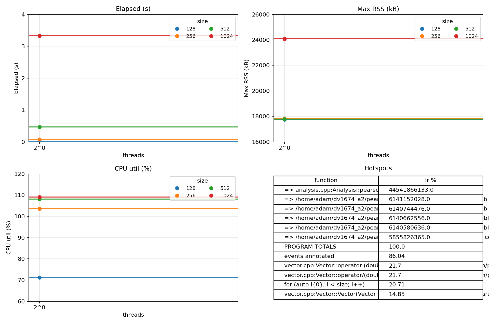
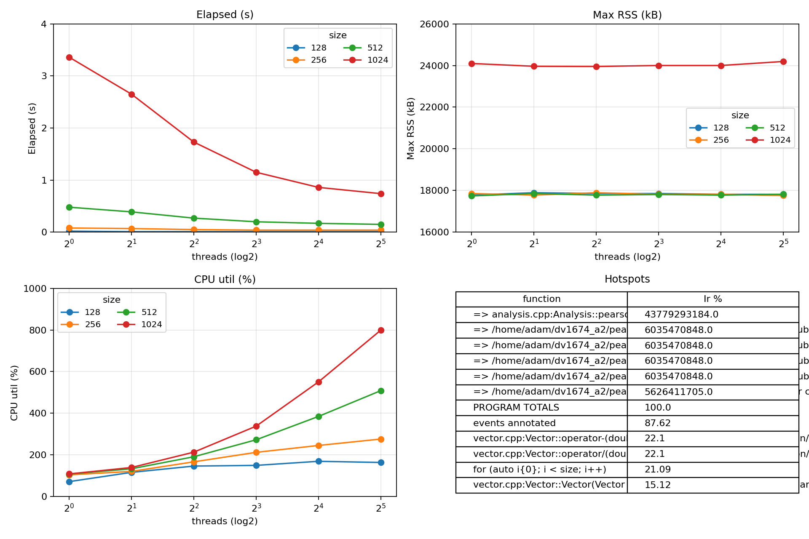
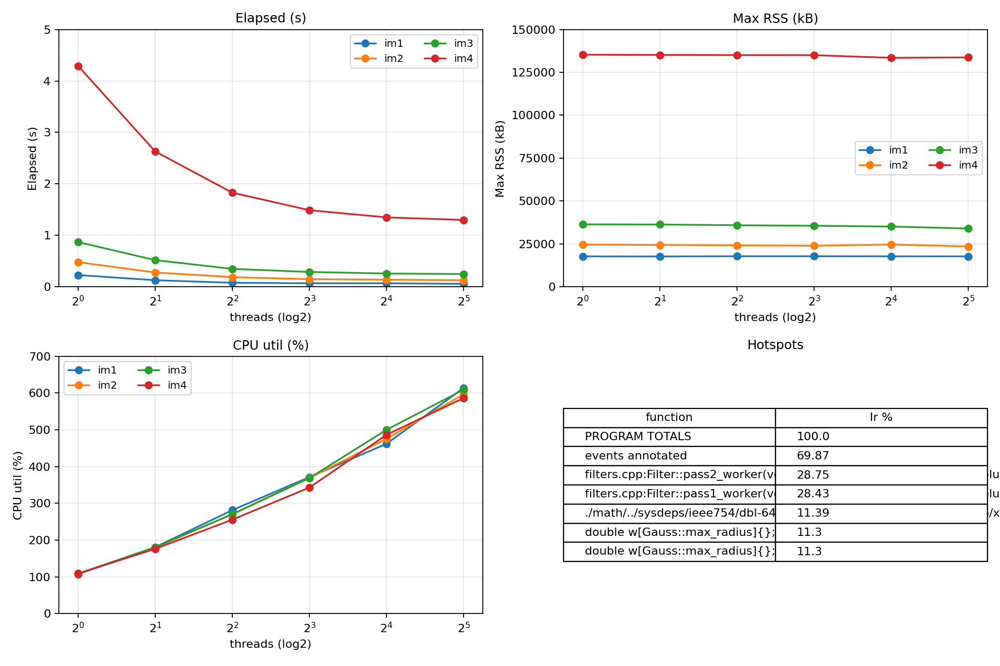

# Title: Optimizing and Parallelizing Pearson & Blur

**Authors:** Adam Abdullah - Daniel , Group 1  

## Abstract
_What we optimized and parallelized (Pearson & Blur), the WSL2 environment, headline speedups vs. baseline (see §6), and that outputs were verified for correctness._

---

## 1. Introduction
This report covers baseline measurements for the sequential versions of **Pearson** (pairwise correlation) and **Blur** (two-pass image filter), followed by a pthreads-based parallelization of both applications. We measure execution time, memory (Max RSS), and CPU utilization across dataset/image sizes and thread counts, and we report scalability and speedup relative to the sequential baseline.

---

## 2. Experimental Setup

- **Hardware/OS/Compiler:** 12th Gen Intel® Core™ i9-12900K (12 cores / 24 threads), 31 GiB RAM visible to WSL2, Ubuntu 22.04.5 LTS (kernel 6.6.87.2-microsoft-standard-WSL2), GCC/G++ 11.4.0, glibc 2.35, GNU ld 2.38, Make 4.3, perf 6.6.87, Valgrind 3.18.1. *(Environment: WSL2 on Windows host.)*
- **Build:** C++17, `-O2 -g -pthread`, Makefiles per app.
- **Inputs:**  
  - **Pearson datasets:** `128, 256, 512, 1024` (rows per dataset).  
  - **Blur images:** four `.ppm` files from `data/` (for all measurements, **radius = 15**).
- **Metrics & Tools:** `/usr/bin/time -v` (elapsed, Max RSS), `perf` (task-clock, context-switches, cpu-migrations, page-faults). Callgrind used for hotspot tables.
- **Methodology:** 5 repetitions per point; aggregate with IQR trimming; report `elapsed_mean` and compute **speedup** as `T1 / Tt` (per size).  
- **Correctness:** `verify.sh` (both apps) on representative sizes/images.

---

## 3. Baseline Performance (Sequential, Unoptimized)

### 3.1 Pearson (sequential)
**Algorithm:** mean-center → normalize (L2) → dot product → clamp to `[-1, 1]`.

**Results (aggregated over 5 reps):**

| size | elapsed_mean (s) | Max RSS (kB) | task_clock_ms | CPUs util. (%) |
|-----:|------------------:|--------------:|---------------:|---------------:|
| 128  | 0.0200 | 17,740.8 | 14.2480 | 71.24 |
| 256  | 0.0800 | 17,817.6 | 82.8240 | 103.53 |
| 512  | 0.4700 | 17,779.2 | 508.0380 | 108.10 |
| 1024 | 3.3275 | 24,073.0 | 3,627.5275 | 109.02 |

<!-- Blur baseline (sequential) -->


**Notes:** Cost grows quadratically with number of datasets (pair count). CPU utilization hovers ~100% on a single thread due to compute-bound inner products and memory locality of contiguous vector storage.

---

### 3.2 Blur (sequential)
**Algorithm:** separable two-pass blur (horizontal into scratch, then vertical into destination) with radius **15**.

**Results:** _Insert the dashboard for the four images (elapsed, RSS, CPU util.)._

_Figure B1 — Blur baseline (sequential dashboard):_  
`blur/bench_<STAMP>/seq_dashboard.png`

**Notes:** Two-pass structure improves cache locality vs. naïve 2D window; memory bandwidth and image dimensions dominate runtime. (Detailed numbers to be inserted after running `bench_blur.sh`.)

---

## 4. Optimization and Tuning (Sequential → Optimized)
> **Requirement:** apply at least **two** optimizations; each must show a measurable improvement and preserve correctness.

> **Status:** _To be completed after implementing and measuring two+ sequential optimizations for Pearson and/or Blur. For each optimization, document: rationale, code changes (files/functions), and before/after metrics (figures/tables)._

- **4.1 Optimization #1 — _Name_**  
  Rationale → Change → Impact (before/after figure & table).

- **4.2 Optimization #2 — _Name_**  
  Rationale → Change → Impact (before/after figure & table).

---

## 5. Parallelization with pthreads

### 5.1 Pearson — design & results
**Partitioning:** shard the outer loop over dataset index `i` across threads; pre-size output to `n(n−1)/2`; use deterministic `pair_index(n,i,j)` so each `(i,j)` writes a unique slot. No locks; one join at the end. **Correctness/Order** identical to sequential.

**Scalability & speedup (vs. 1-thread time for same size):**

**size = 128** (T₁ = 0.0200 s)
| threads | elapsed_mean (s) | speedup |
|--------:|------------------:|--------:|
| 1 | 0.0200 | 1.00 |
| 2 | 0.0140 | 1.43 |
| 4 | 0.0100 | 2.00 |
| 8 | 0.0100 | 2.00 |
| 16 | 0.0100 | 2.00 |
| 32 | 0.0100 | 2.00 |

**size = 256** (T₁ = 0.0800 s)
| threads | elapsed_mean (s) | speedup |
|--------:|------------------:|--------:|
| 1 | 0.080 | 1.00 |
| 2 | 0.070 | 1.14 |
| 4 | 0.050 | 1.60 |
| 8 | 0.040 | 2.00 |
| 16 | 0.040 | 2.00 |
| 32 | 0.040 | 2.00 |

**size = 512** (T₁ ≈ 0.4700 s)
| threads | elapsed_mean (s) | speedup |
|--------:|------------------:|--------:|
| 1 | 0.484 | 0.97 |
| 2 | 0.390 | 1.21 |
| 4 | 0.274 | 1.72 |
| 8 | 0.200 | 2.35 |
| 16 | 0.170 | 2.76 |
| 32 | 0.154 | **3.05** |

**size = 1024** (T₁ ≈ 3.3275 s)
| threads | elapsed_mean (s) | speedup |
|--------:|------------------:|--------:|
| 1 | 3.365 | 0.99 |
| 2 | 2.648 | 1.26 |
| 4 | 1.730 | 1.92 |
| 8 | 1.150 | 2.89 |
| 16 | 0.855 | 3.89 |
| 32 | 0.738 | **4.51** |

<!-- Pearson baseline (sequential) -->


<!-- Pearson parallel -->



**Discussion:** Stronger scaling emerges for larger sizes where work dominates overhead. Small sizes (128/256) saturate around ~2× due to overheads and limited parallel work per thread.

---

### 5.2 Blur — design & results
**Partitioning:** split **rows** `[y0, y1)` per thread; join (barrier) between the horizontal and vertical passes; traversal order (x→y) identical to sequential. **Correctness** matches sequential output (verified).

**Scalability & speedup:** (aggregated over 5 reps; `speedup = T1 / Tt`)

_im1 (radius=15)_
| threads | elapsed_mean (s) | speedup |
|-------:|------------------:|--------:|
| 1 | 0.2260 | 1.0177 |
| 2 | 0.1300 | 1.7692 |
| 4 | 0.0840 | 2.7381 |
| 8 | 0.0700 | 3.2857 |
| 16 | 0.0660 | 3.4848 |
| 32 | 0.0600 | **3.8333** |

_im2 (radius=15)_
| threads | elapsed_mean (s) | speedup |
|-------:|------------------:|--------:|
| 1 | 0.4800 | 1.0000 |
| 2 | 0.2800 | 1.7143 |
| 4 | 0.1900 | 2.5263 |
| 8 | 0.1500 | 3.2000 |
| 16 | 0.1425 | 3.3684 |
| 32 | 0.1300 | **3.6923** |

_im3 (radius=15)_
| threads | elapsed_mean (s) | speedup |
|-------:|------------------:|--------:|
| 1 | 0.8700 | 1.0000 |
| 2 | 0.5200 | 1.6731 |
| 4 | 0.3525 | 2.4681 |
| 8 | 0.2900 | 3.0000 |
| 16 | 0.2600 | 3.3462 |
| 32 | 0.2460 | **3.5366** |

_im4 (radius=15)_
| threads | elapsed_mean (s) | speedup |
|-------:|------------------:|--------:|
| 1 | 4.2900 | 1.0061 |
| 2 | 2.6325 | 1.6395 |
| 4 | 1.8260 | 2.3636 |
| 8 | 1.4925 | 2.8918 |
| 16 | 1.3525 | 3.1911 |
| 32 | 1.3025 | **3.3136** |


<!-- Blur parallel -->


---

## 6. Conclusion
- **Sequential baselines:** established for Pearson and Blur (radius=15).  
- **Parallel pthreads:** Pearson reached up to **~4.51×** at 32 threads on size **1024**; ~3.05× at size **512**. Small sizes saturate near 2×.  
- **Next steps:** implement at least **two** sequential optimizations (e.g., weight reuse/hoisting, allocation elimination, cache-friendly traversal, I/O buffering, vectorization) and re-measure to demonstrate additional gains while preserving correctness.

---

## Appendix

### A. Build & Run
- **Pearson:**  
  `make -C pearson clean && make -C pearson`  
  `./pearson [infile] [outfile]`  
  `./pearson_par [infile] [outfile] [num_threads]`
- **Blur:**  
  `make -C blur clean && make -C blur`  
  `./blur [radius] [infile] [outfile]`  
  `./blur_par [radius] [infile] [outfile] [num_threads]`
- **Benches & Plots:**  
  `./scripts/bench_pearson.sh` → `bench_<STAMP>/{seq,par}_dashboard.png`, `agg_{seq,par}.csv`  
  `./scripts/bench_blur.sh` → `bench_<STAMP>/{seq,par}_dashboard.png`, `agg_{seq,par}.csv`

### B. Submission Structure (Required)

```
group_XX/
blur/
Makefile
blur
blur_par
...sources...
pearson/
Makefile
pearson
pearson_par
...sources...
```

### C. Correctness
- `verify.sh` used on representative inputs for both applications; outputs match the sequential reference.
